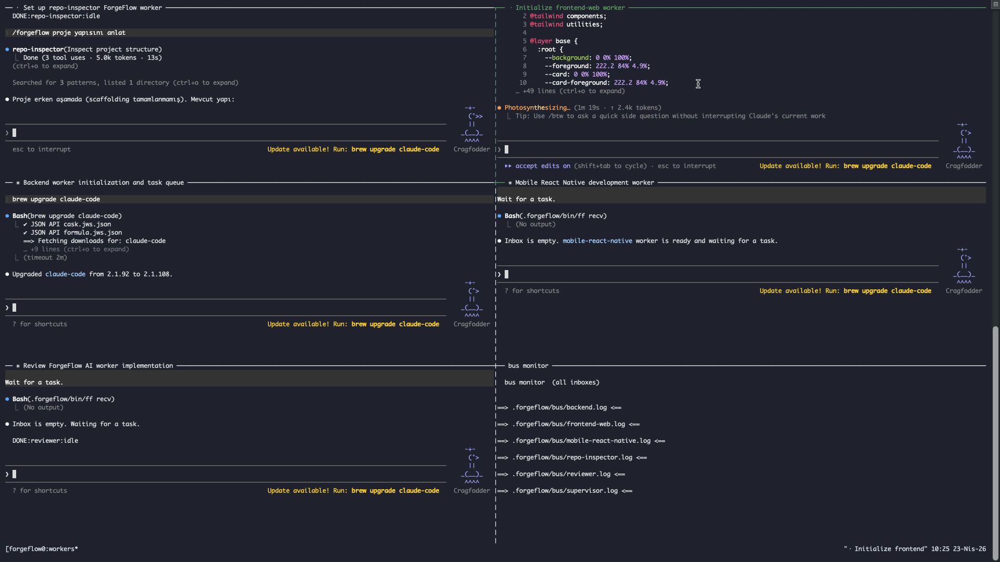
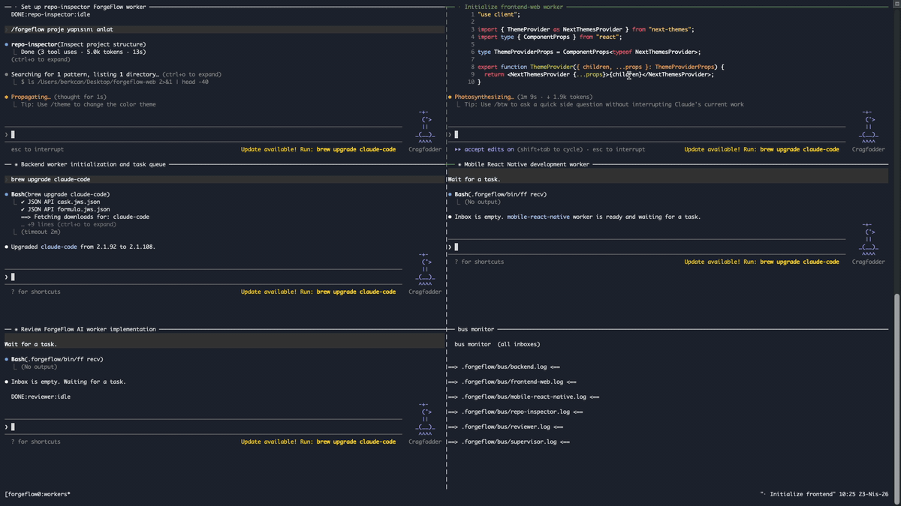

<div align="center">

# ⚡ ForgeFlow AI

### Claude Code için odaklı çoklu ajan mühendislik akışı.
#### Scope disiplinli işçiler. Düşük token. Varsayılan olarak modern UI, dark mode ve i18n.

<br />

**🌐 Dil:** [English](README.md) · **Türkçe**

<br />

[](LICENSE)
[](https://claude.com/claude-code)
[](CONTRIBUTING.md)
[](README.tr.md)

<br />


<br />

> **Çoğu çoklu ajan repo'su daha çok gürültü üretir. ForgeFlow AI daha çok odak üretir.**

<br />



<br />

[Hızlı Başlangıç](#-hızlı-başlangıç) · [Ekip](#-ekip) · [Kullanım](#-örnek-kullanım) · [Çoklu dil kurulumu](#-çoklu-dil-readme-kurulumu) · [English README](README.md)

</div>

---

## 🧭 ForgeFlow AI nedir?

ForgeFlow AI, Claude Code projenin içine yerleşen bir çoklu ajan iş akışıdır. Altı tane scope'u belli işçi (supervisor, repo-inspector, frontend-web, backend, mobile-react-native, reviewer), bir slash komutu ve beş skill rehberi getirir. Amaç basit: token israfını ve ilgisiz dosya değişikliklerini bitirmek.

- 🔍 **Önce incele, sonra yaz.** Repo-inspector önce ilgili alanı çıkarır.
- 🎯 **Katı işçi kapsamları.** Web backend'e dokunmaz. Backend UI'ya dokunmaz. Mobile web'e dokunmaz.
- 🪶 **Düşük token mimarisi.** Tüm repo taraması yok. Dosya dump'ı yok. Görevi tekrarlama yok.
- 🎨 **Üretime hazır UI.** Dark mode, i18n, modern boşluk, gerçek bileşen tekrar kullanımı.
- 📱 **Mobil React Native.** Android ve iOS birlikte.
- ✅ **Her işçi temiz biter.** `DONE:<agent>:<task-id>`.

---

## ✨ Neden var?

Çoğu çoklu ajan repo'su bir prompt yığını gibi hissettiriyor. Token yakıyor, istemediğin dosyaları değiştiriyor ve önüne bir çıktı duvarı koyuyor. ForgeFlow AI, güvenebileceğin tekrarlı bir iş akışı isteyen geliştiriciler için yapıldı. Daha az okur. Daha az yazar. Daha çok teslim eder.

---

## 🧩 Farkı ne?

| | Tipik çoklu ajan repo | ForgeFlow AI |
|---|---|---|
| Repo okuma | Tüm repo taraması | Sadece kapsamlı inceleme |
| İşçi scope'u | Gevşek, üst üste binen | Katı, ayrık |
| Review adımı | Her şeyi tekrar okur | Sadece diff ve ilgili sözleşmeler |
| UI varsayılanı | Yok | Dark mode, i18n, tekrar kullanılabilir bileşenler |
| Mobil | Eklenti gibi ya da yok | React Native, Android ve iOS birinci sınıf |
| Bitirme | Açık uçlu | `DONE:<agent>:<task-id>` |

---

## 👥 Ekip

| İşçi | Görev |
|---|---|
| 🧠 `supervisor` | Görevi sınıflar, sadece gereken işçileri devreye alır |
| 🔎 `repo-inspector` | Yapı, bağımlılık ve riskleri çıkarır. Varsayılan olarak salt okuma |
| 🎨 `frontend-web` | Web UI, sayfalar, bileşenler, frontend state ve entegrasyonlar |
| ⚙️ `backend` | API, auth, doğrulama, veritabanı, iş mantığı |
| 📱 `mobile-react-native` | Android ve iOS için React Native |
| 🧪 `reviewer` | Sadece diff'i ve ilgili sözleşmeleri inceler |

---

## 🪶 Düşük token felsefesi

- Gerçekten gerekmedikçe tüm repo taraması yok.
- İşçiler sadece kendi scope'undaki dosyaları okur.
- Çıktı kısa tutulur. Dolgu yok, görevi tekrar etme yok, kapanış nezaketi yok.
- Var olan desenler her zaman yeni soyutlamalara yeğlenir.
- Her düşünce için ayrı işçi değil, her scope için bir işçi.

---

## 🎨 UI, dark mode ve i18n

ForgeFlow AI için UI kalitesi bir bonus değil, bir gereklilik.

- ✅ Modern ve üretime hazır görünüm. Şablon hissi yok, yapay sertlik yok.
- ✅ Dark mode birinci sınıf. Tema tokenları merkezi tutulur.
- ✅ String'ler i18n katmanında yaşar. Türkçe ve İngilizce minimum.
- ✅ Tek seferlik parçalar yerine tekrar kullanılabilir bileşenler.
- ✅ Responsive ve erişilebilir varsayılan olarak.

`frontend-web` ve `mobile-react-native` işçileri hardcoded renk ya da hardcoded kullanıcı metni yazmaz. `reviewer` her ikisini de finding olarak işaretler.

---

## 🎬 Demo



---

## 🚀 Hızlı Başlangıç

### 1. Gereksinimler

- [Claude Code](https://claude.com/claude-code) kurulu ve giriş yapılmış olmalı.
- Çalışmak istediğin herhangi bir proje (Next.js, NestJS, Expo, React Native CLI, monorepo, fark etmez).
- **tmux** (önerilir) split pane düzeni için. Installer yoksa otomatik kurmayı teklif eder. Manuel kurulum:

| Platform | Komut |
|---|---|
| macOS (Homebrew) | `brew install tmux` |
| Ubuntu / Debian | `sudo apt-get install tmux` |
| Fedora | `sudo dnf install tmux` |
| Arch | `sudo pacman -S tmux` |
| Alpine | `sudo apk add tmux` |
| Windows + MSYS2 | `pacman -S tmux` |
| Windows + WSL | WSL içinde Ubuntu/Debian komutunu çalıştır |
| Windows (native) | tmux yok, Windows Terminal ile `--windows` modunu kullan |

### 2. Tek komutla kurulum

Herhangi bir projenin kök klasöründen:

```bash
curl -fsSL https://raw.githubusercontent.com/berkcangumusisik/forge-flow-ai/main/install.sh | bash
```

Ya da hedef klasörü ver:

```bash
curl -fsSL https://raw.githubusercontent.com/berkcangumusisik/forge-flow-ai/main/install.sh | bash -s -- /path/to/project
```

Installer şunları yapar:

1. `.claude/` ve `CLAUDE.md` dosyalarını projene kopyalar.
2. Terminaller arası mesaj bus'ını `.forgeflow/` altına kurar.
3. **5 Claude Code worker terminali** açar: `repo-inspector`, `frontend-web`, `backend`, `mobile-react-native`, `reviewer`.

#### Manuel kurulum (alternatif)

```bash
git clone https://github.com/berkcangumusisik/forge-flow-ai.git
cd forge-flow-ai
./install.sh /path/to/your/project
```

#### Installer flagleri

```text
./install.sh [target-dir] [--no-spawn] [--tmux|--windows] [--workers=<set>]
```

| Flag | Etki |
|---|---|
| `--no-spawn` | Sadece dosyaları kopyalar, terminal açmaz |
| `--tmux` | tmux tiled düzenini zorla (tek pencere, tüm pane'ler bir ekranda) |
| `--windows` | Ayrı terminal pencerelerini zorla |
| `--workers=<set>` | Hangi worker'ların açılacağını seç (aşağıdaki preset'lere bak) |

Varsayılan: tmux varsa kullanır (yoksa kurmayı teklif eder), yoksa ayrı pencereler. Default olarak 5 worker hepsi açılır.

#### Worker preset'leri

Görevin gerektirdiği en küçük seti seç. Küçük set = büyük pane = göze kolay.

| Preset | Açılan worker'lar |
|---|---|
| `--workers=web` | `frontend-web`, `reviewer` |
| `--workers=backend` | `backend`, `reviewer` |
| `--workers=backend-only` | `backend` |
| `--workers=full-stack` | `frontend-web`, `backend`, `reviewer` |
| `--workers=mobile` | `mobile-react-native`, `reviewer` |
| `--workers=all` | 5'i birden (default) |
| `--workers=a,b,c` | Elle, virgülle ayrılmış worker isimleri |

#### Örnekler

```bash
# Full stack (web + backend)
./install.sh ~/Desktop/my-app --tmux --workers=full-stack

# Landing page ya da saf web işi
./install.sh ~/Desktop/site --tmux --workers=web

# Saf API projesi
./install.sh ~/Desktop/api --tmux --workers=backend

# Sadece mobil
./install.sh ~/Desktop/mobile-app --tmux --workers=mobile

# Elle seçim
./install.sh ~/Desktop/proj --tmux --workers=frontend-web,backend,reviewer

# Hepsi, tmux düzeni
./install.sh ~/Desktop/proj --tmux
```

Bus her zaman tüm worker'lar için kurulur, açmasan bile inbox'ları var. İstediğin zaman installer'ı farklı `--workers` set'iyle yeniden çalıştırıp daha fazla worker açabilirsin.

### 3. İlk görevi çalıştır

5 terminalden herhangi birinde yaz:

```text
/forgeflow tema ve dil seçimli bir ayarlar sayfası ekle
```

`supervisor` görevi sınıflar, sadece gereken işçileri devreye alır ve yönlendirir. Her işçi `DONE:<agent>:<task-id>` ile biter.

---

## 📡 Terminaller arası haberleşme

5 terminal birbirine `.forgeflow/bus/` altındaki dosya tabanlı bus üzerinden konuşur. Her işçinin bir inbox log dosyası var. Yardımcı CLI `ff` dosyası `.forgeflow/bin/ff`'te ve spawn edilen terminallerin `PATH`'inde bulunur.

### Komutlar

```bash
ff send <worker> "<mesaj>"       # belirli bir işçiye gönder
ff broadcast "<mesaj>"           # tüm işçilere gönder
ff watch                         # kendi inbox'ını canlı izle
ff recv                          # inbox'ı oku ve temizle
ff ls                            # tüm inbox'ları ve satır sayılarını listele
ff clear <worker>                # inbox'ı sıfırla
```

Her terminal otomatik olarak `FF_WORKER=<ad>` export eder, böylece `send` göndereni bilir.

### Örnek akış

```text
# backend terminalinde
ff send frontend-web "GET /api/invoices artık items:[] formatında dönüyor"

# frontend-web terminalinde
ff recv
# [14:22:07] from=backend: GET /api/invoices artık items:[] formatında dönüyor
```

### tmux düzeni

Tek pencere, tiled düzen, mouse açık. Tüm worker'lar aynı ekranda.

```
┌────────────────┬────────────────┬────────────────┐
│ repo-inspector │ frontend-web   │ backend        │
│ claude         │ claude         │ claude         │
│                │                │                │
├────────────────┼────────────────┼────────────────┤
│ mobile-rn      │ reviewer       │ bus monitor    │
│ claude         │ claude         │ tail -F *.log  │
│                │                │                │
└────────────────┴────────────────┴────────────────┘
```

- **Pane'e tıkla** → o pane aktif olur, mouse açık.
- **Splitter'ları sürükle** → pane boyutlarını ayarla.
- **Scroll** → trackpad ile pane içinde kaydır.
- `Ctrl+b z` → aktif pane'i tam ekran yap, tekrar bas geri dön.
- `Ctrl+b ok tuşları` → klavyeyle pane değiştir.
- `Ctrl+b d` → session'dan ayrıl. Geri dön: `tmux attach -t forgeflow`.

Düzen worker sayısına göre otomatik ayarlanır. `--workers=web` sana 3 pane verir (frontend-web, reviewer, bus monitor), laptop ekranında çok daha rahat.

### Platform matrisi

| Platform | Varsayılan düzen |
|---|---|
| macOS | tmux varsa kullanır, yoksa Terminal.app veya iTerm2 pencereleri |
| Linux | tmux varsa kullanır, yoksa gnome-terminal / konsole / xterm vb. |
| Windows (WSL, MSYS2) | tmux varsa kullanır |
| Windows (native) | Windows Terminal (`wt.exe`) split tabs, yoksa düz `cmd` pencereleri |

> tmux Windows'ta **hazır gelmez**. Seçenekler: WSL (`sudo apt install tmux`), MSYS2 (`pacman -S tmux`), ya da tmux'u atla ve `--windows` modu ile Windows Terminal kullan. Düz CMD ve PowerShell'de tmux yoktur.

---

## 💡 Örnek kullanım

```text
/forgeflow tema ve dil seçimli bir ayarlar sayfası ekle
```

```text
/forgeflow zod doğrulamalı POST /api/invoices endpoint'i yaz
```

```text
/forgeflow mobil uygulamaya 3 ekranlı bir onboarding akışı ekle
```

```text
/forgeflow merge öncesi mevcut branch'i review et
```

```text
/forgeflow ödeme modülünü incele ve risklerini listele
```

---

## 🌐 Çoklu dil README kurulumu

ForgeFlow AI her dil için ayrı bir README dosyası tutar. Desen basit ve herhangi bir GitHub repo'sunda çalışır.

### Nasıl çalışır?

1. **`README.md`** İngilizce sürümdür. GitHub repo ana sayfasında varsayılan olarak bunu gösterir.
2. **`README.tr.md`** Türkçe sürümdür.
3. Her iki dosyanın üstünde bir **dil seçici** bulunur ve birbirine link verir.
4. Badge'ler, başlık sırası ve anchor'lar iki dosya arasında tutarlı kalır. Deneyim bütün hissettirir.

### Dosya yerleşimi

```
forge-flow-ai/
├── README.md        # İngilizce, varsayılan
└── README.tr.md     # Türkçe
```

### Yeni dil nasıl eklenir?

1. `README.md` dosyasını `README.<locale>.md` olarak kopyala (örneğin `README.de.md`).
2. İçeriği çevir. Başlık sırası ve anchor'lar aynen kalsın.
3. **Her** README dosyasının üstündeki dil seçiciyi güncelle. Her dosya diğerlerinin hepsine link versin.

Örnek dil seçici satırı:

```md
🌐 Dil: [English](README.md) · Türkçe · [Deutsch](README.de.md)
```

### İpuçları

- Dosya isimleri küçük harf ve ISO locale eki ile olsun (`.tr`, `.de`, `.es`).
- Kod blokları, komutlar ve dosya yollarını çevirme.
- Başlıklar kısa olsun, anchor'lar temiz kalsın.
- Yeni bir bölüm eklediğinde aynı PR içinde tüm dillere ekle. Diller birbirinden uzaklaşmasın.

Aynı felsefe ajanların içinde de geçerli: `frontend-web` ve `mobile-react-native` işçileri kullanıcı metnini koda gömmez ve desteklenen her locale için çeviri anahtarı ister.

---

## 🗂 Repo yapısı

```
forge-flow-ai/
├── .claude/
│   ├── commands/
│   │   └── forgeflow.md            # ana slash komutu
│   ├── agents/
│   │   ├── supervisor.md
│   │   ├── repo-inspector.md
│   │   ├── frontend-web.md
│   │   ├── backend.md
│   │   ├── mobile-react-native.md
│   │   └── reviewer.md
│   └── skills/
│       ├── inspect-task/SKILL.md
│       ├── implement-web/SKILL.md
│       ├── implement-backend/SKILL.md
│       ├── implement-mobile/SKILL.md
│       └── review-diff/SKILL.md
├── CLAUDE.md                       # proje operasyon rehberi
├── CONTRIBUTING.md
├── LICENSE
├── README.md                       # İngilizce
└── README.tr.md                    # Türkçe
```

---

## 🛣 Yol haritası

- [ ] Opsiyonel `desktop` işçisi (Electron / Tauri)
- [ ] CI ve deploy için opsiyonel `devops` işçisi
- [ ] Next.js, Expo, NestJS için hazır preset'ler
- [ ] Başlangıç tema ve i18n paketleri
- [ ] ForgeFlow'a bağlı örnek repolar
- [ ] `DONE:` işareti için VS Code snippet paketi

---

## 🤝 Katkı

PR'lar memnuniyetle kabul edilir. Küçük, odaklı ve [CLAUDE.md](CLAUDE.md)'deki işçi sınırlarına uygun olsun. Açmadan önce [CONTRIBUTING.md](CONTRIBUTING.md) dosyasını oku.

---

## ⭐ Yıldız geçmişi

<a href="https://star-history.com/#berkcangumusisik/forge-flow-ai&Date">
  <picture>
    <source media="(prefers-color-scheme: dark)" srcset="https://api.star-history.com/svg?repos=berkcangumusisik/forge-flow-ai&type=Date&theme=dark" />
    <source media="(prefers-color-scheme: light)" srcset="https://api.star-history.com/svg?repos=berkcangumusisik/forge-flow-ai&type=Date" />
    
  </picture>
</a>

---

## 📄 Lisans

MIT. Bkz. [LICENSE](LICENSE).

---

<div align="center">

### Daha az kur. Daha çok odaklan. Daha keskin teslim et.

[← English README](README.md)

</div>
